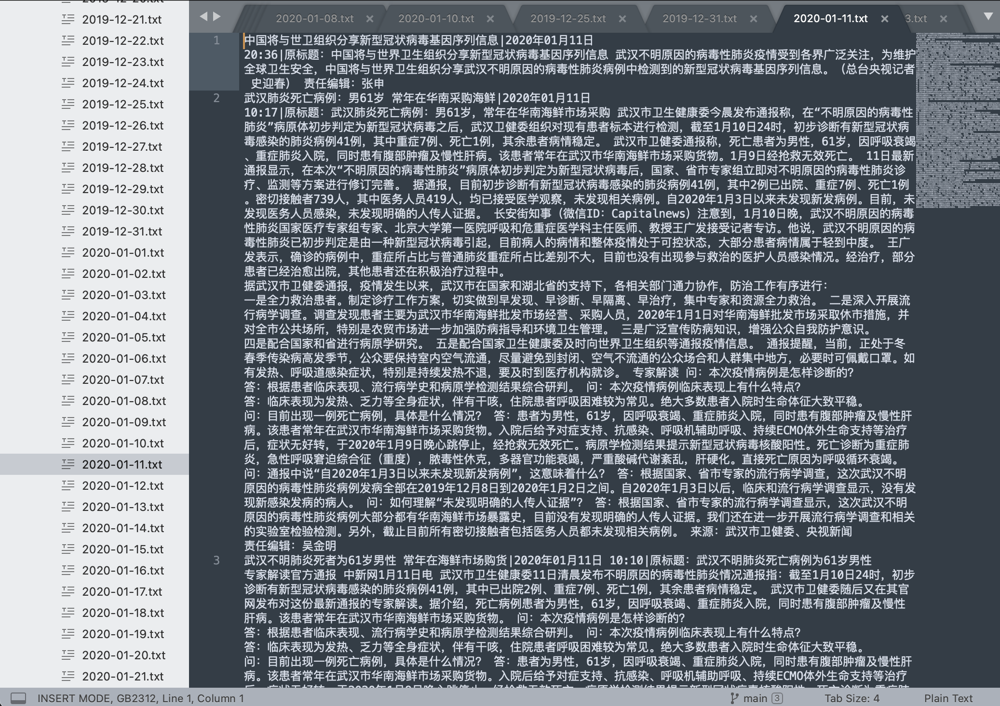

# 疫情下的网络社会及公众心态研究

## 目录

[TOC]

## 01-成员基本信息

---

|  姓名  |   学号    |    电话     |                   分工                   |
| :----: | :-------: | :---------: | :--------------------------------------: |
| 赵宇舟 | 191250204 | 18851865055 |  数据内容爬取、机器学习与模型训练、nlp   |
| 林正顺 | 191250088 | 15371077531 |     数据链接爬取、信息检索、概统分析     |
| 陶泽华 | 191250133 | 19850355091 | 数据内容爬取、数据筛选与分类、数据可视化 |

## 02-绪论

***

### 2.1-摘要


**关键字**：疫情，心态分析，python，数据爬取，机器学习，朴素贝叶斯，NLP，数据可视化

### 2.2-研究背景

> ​		中国社会正处在深刻而快速的转型期，其中，在社会变迁层面，社会结构的快速分化，以“撕裂”的方式强化了社会团体、阶层 之间的张力，使得整体社会结构出现紧张(李汉林、魏钦恭、张彦, 2010)，并投射在个体心理层面，进一步凸显出公众的社会认知、 情绪、信念、意向、行动等对社会治理的重要影响(王俊秀, 2014;杨宜音, 2006) 。 同时，随着互联网应用的不断普及，日益多元复杂的公众情绪，借助网络的力量传播和放大，对社会心态的塑形力量进一步增强，赋予了群体心理及集体行为的极化可能(周晓虹，2014)。 当下新型冠状病毒(COVID-19) 肆虐全球，给人们的生产和生活产生了极大影响，也形成了疫情下独特的网络社会心态 和公众情绪。 因此，立足此次新型冠状病毒(COVID-19)重大突发公共卫生事件情境，借助适宜的数据与计量手段，准确并客观地 了解公众的网络社会心态与基于此呈现出的行为规律，就可能实现公众的情绪引导，让大众以积极的心态与政府一起应对和处理公共卫生事件及其衍生问题，维护国家与社会的长治久安。
>

### 2.3-代码开源地址

**GitHub:** [dataScience_finalTask](https://github.com/yuzhouzhao/dataScience_finalTask.git) 

**数据可视化: **[https://linzs148.github.io/Visualization/](https://linzs148.github.io/Visualization/)（建议使用Chrome浏览器）

## 03-数据获取及初步处理

---

### 3.1-方法

利用python和一系列库进行新闻、b站评论和微博评论的爬取

### 3.2-过程

分三步进行：

1. 新闻链接爬取+新闻内容爬取
2. bilibili视频链接爬取+bilibili视频评论爬取
3. 微博评论爬取

#### 新闻链接爬取+新闻内容爬取：

- 思路

  虽然在新浪新闻的官网上也能够进行关键词的搜索，进而对得到所有相关新闻的链接，但是这样有两点不方便

  1. 新浪新闻的官网对于显示的新闻熟练做了限制，不能够获取到比较早期的新闻链接
  2. 在页面上根据时间进行筛选、获取新闻链接对应的元素都不太方便

  所以我没有选择直接爬去新浪新闻主页，而是在查询了相关资料之后找到了新浪新闻的[数据接口](https://feed.mix.sina.com.cn/api/roll/get?pageid=153&lid=2509&etime=1576944001&stime=1577030402&ctime=1577030405&date=2019-12-22&k=&num=50&page=1)

  https://feed.mix.sina.com.cn/api/roll/get?pageid=153&lid=2509&etime=1575734400&stime=1575820800&ctime=1575820800&date=2019-12-22&num=50&page=1

  只要改变url链接里的`date`参数就能更改新闻的日期，通过更改`page`参数能够模拟翻页，`num`参数控制每一页最大新闻数量

- 问题
  比较令我困惑的是`etime`、`stime`和`ctime`参数到底是什么含义

-  解决
   通过观察发现，`stime`和`ctime`的值总是相等的，而且它们的值总是比`stime`的值大86400，86400到底有什么意义呢？

   我突然想到`86400 = 24 * 60 * 60`, 这说明86400代表的是一天的时间（以`秒`为单位），又经过搜索我查到这三个参数均为时间戳的形式，经过这番准备接下来的工作就非常容易完成了

- 流程：在循环里改变参数的值获取某一天内的所有新闻，并在关键词列表里面进行匹配来筛选出所有和疫情相关的新闻

#### bilibili视频链接爬取+bilibili视频评论爬取：

​    	根据"疫情", "新冠", "抗疫", "口罩", "病例", "钟南山", "防疫", "火神山", "雷神山“，”肺炎“等一系列关键词，同时借助requests库、BeautifulSoup库来筛选对应上述关键词的链接，并将结果存入了bilibili.txt文件中。再根据获得的链接获得视频的BV号去爬取视频的评论。

#### 微博评论爬取：

​		首先用cookies模拟登陆网页版新浪微博，然后根据指定的官方微博和指定的微博时间对应的微博链接来抓取该时间段的前15条微博的评论。

### 3.3-代码解释

**新闻链接爬取+新闻内容爬取代码：**

```python
# -*- coding: utf-8 -*-
import requests
from bs4 import BeautifulSoup


def readAndWrite(url):
    response = requests.get(url)
    response.encoding = 'utf-8'
    soup = BeautifulSoup(response.text, "html.parser")
    result = soup.find(attrs={'class': 'article'})
    try:
        ret = result.text
        ret = ret.replace("\n", "")
        ret = ret.replace(" ", "")
        ret = ret.replace("　　", "")
        ret += '\n'
    except:
        return

    with open('jstv_news.txt', 'a') as f:
        f.writelines(ret)


if __name__ == '__main__':

    # readAndWrite('http://news.jstv.com/a/20201206/1607262930567.shtml')
    f = open('jstv_news.txt')
    for i in f:
        url = i.replace("\n", "")
        readAndWrite(url)
```

**bilibili视频链接爬取+bilibili视频评论爬取代码：**

```python
# b站视频链接爬取代码
keywords = ["疫情", "新冠", "抗疫", "口罩", "病例", "钟南山", "防疫", "火神山", "雷神山", "肺炎"]

# 根据设定的关键词来获得b站相关视频的链接
def getUrls(keyword, page):
    url = "https://search.bilibili.com/all?order=click"
    # 设定关键词
    params = {'keyword': keyword, 'page': page}
    # 爬虫常规代码
    response = requests.get(url, params=params, headers=headers)
    response.raise_for_status()
    response.encoding = response.apparent_encoding
    soup = BeautifulSoup(response.text, "html.parser")
    lis = soup.find_all('li', {'class': "video-item matrix"})
    
    for li in lis:
        attributes = li.a.attrs
        spans = li.find_all('span')
        # 将得到的链接和时间写入文件
        with open('bilibili-url.txt', 'a') as f:
            f.writelines('https:' + attributes['href'] + " " + spans[5].text.strip() + '\n')
```

```python
# b站视频评论爬取代码
if __name__ == '__main__':
    sleep_time = 2
    file = open('bilibili-url.txt')  # 视频链接所在文件
    for i in file:
        BV_CODE = i[31:43]  # 从链接中截取得到视频的BV号
        oid = get_oid(BV_CODE) # 获得视频的oid号
        video_time = i[-11:] # 从链接中截取得到视频发表的时间
        f = open(f'/Users/taozehua/PycharmProjects/数据科学/bilibili-url-comment/' + video_time + BV_CODE + '.txt', 'w',
                 encoding='utf-8')
        page = 1
        while True:
            try:
                data = get_data(page, oid)
                write(data) #向文件写入数据
                end_page = 15 # 设定连续读取15页的评论
                if page == end_page:
                    break
                page += 1
            except Exception as e:
                print('ERROR:', e)
                break
        f.close()
```

**微博评论爬取代码：**

```python
# 设置cookies 模拟登陆网页版微博，cookies由本机登录时获得
self.headers = {
            "cookie": "login_sid_t=95e31daa102176d1debb61e844641c26; cross_origin_proto=SSL; _s_tentry=passport.weibo.com; Apache=8896751903602.45.1611205480375; SINAGLOBAL=8896751903602.45.1611205480375; ULV=1611205480379:1:1:1:8896751903602.45.1611205480375:; wb_view_log_5688140475=1440*9002; wb_view_log=1440*9002; WBStorage=8daec78e6a891122|undefined; crossidccode=CODE-tc-1L2uul-2O9Vrn-3NXFKeQ59aniHK8bfdc35; SSOLoginState=1611214485; SUB=_2A25NDV7FDeRhGeNI41oQ9C7IzDmIHXVuDmKNrDV8PUJbkNAKLWTskW1NSDShAmgWg52xu-LVa7tA1onXiM57xVOs; SUBP=0033WrSXqPxfM725Ws9jqgMF55529P9D9WW0TQIzrxRpmDardhs5o9p15NHD95QfSonReKB7ShMfWs4DqcjQi--ciK.RiKLsi--Ri-8si-82i--fi-isiKn0i--ciKnXi-isxsHLM5tt; wvr=6; UOR=,,graph.qq.com; webim_unReadCount=%7B%22time%22%3A1611214550618%2C%22dm_pub_total%22%3A4%2C%22chat_group_client%22%3A0%2C%22chat_group_notice%22%3A0%2C%22allcountNum%22%3A42%2C%22msgbox%22%3A0%7D",
            "user-agent": "Mozilla/5.0 (Windows NT 10.0; WOW64) AppleWebKit/537.36 (KHTML, like Gecko) Chrome/72.0.3626.96 Safari/537.36",
        }

def parse_comment_info(self, url):
    # 爬取评论和评论的时间
    res = requests.write(url, headers=self.headers)
    response = res.json()
    count = response['data']['count']
    html = etree.HTML(response['data']['html'])
    name = html.xpath("//div[@class='list_li S_line1 clearfix']/div[@class='WB_face W_fl']/a/img/@alt")  # 解析评论人的姓名
    info = html.xpath("//div[@node-type='replywrap']/div[@class='WB_text']/text()")  # 解析评论信息
    info = "".join(info).replace(" ", "").split("\n")
    comment_time = html.xpath("//div[@class='WB_from S_txt2']/text()")  # 解析评论时间
    comment_info_list = []
    # 将评论和时间存入
    for i in range(len(name)):
        item = {}
        # 控制存进去的评论数量，过滤不需要的信息
        if info[i] != "：转发微博" and info[i] != "：" and i <= 6:
            item["comment"] = info[i]  # 存储评论的信息
            item["comment_time"] = comment_time[i]  # 存储评论时间
            comment_info_list.append(item)
        else:   break
    return count, comment_info_list
```

### 3.4-成果展示

**新闻内容：**

​		获得了新浪网2019年12月至2020年12月之间的所有与新冠疫情有关的新闻，并且以日期为划分存储。



**b站评论：**

​		获得了b站2019年12月至2020年12月之间的所有与新冠疫情有关的视频的评论，并且以日期为划分存储。


**微博评论：**

​		获得了新浪微博2019年12月至2020年6月之间的一些官方微博的关于疫情报道的评论。


## 04-数据分析及模型训练

---

### 4.1-方法

​		文本情感分析是指用自然语言处理（NLP）、文本挖掘以及计算机语言学等方法对带有情感色彩的主观性文本进行分析、处理、归纳和推理的过程。 

> **维基中文百科：**文本情感分析（也称为意见挖掘）是指用自然语言处理、文本挖掘以及计算机语言学等方法来识别和提取原素材中的主观信息。

​	    我们在本次作业中做的是**基于机器学习的情感分析**，我们将情感分析视为一个二分类的问题，采用机器学习的方法识别。先将文本分词后，选择特征词后转化为词向量，进而将文本矩阵化，利用朴素贝叶斯（Naive Bayes），支持向量机（SVM）等算法进行分类。最终训练得到一个基于机器学习的分类器模型，而模型的分类效果取决于训练文本的选择以及正确的情感标注。

#### 用到的工具：

> - NLTK库（natural language toolkit）：是一套基于python的自然语言处理工具集。
> - Sklearn库（ Scikit-learn ）：机器学习中最简单高效的数据挖掘和数据分析工具。
> - Snownlp库：一个处理中文文本的 Python 类库。

### 4.2-过程

一个完整的机器学习项目一般流程包括：

1. 数据获取及分析
2. 数据预处理
3. 特征工程
4. 训练模型选择与调优
5. 模型评估

#### 分词

​		分词即将书面文本分割成有意义单位的过程，这里的有意义单位即“词”，中文与英文不同，英文天然地以单词为单位组成句子，每个单词之间有空格为分割，而中文则需要另外的处理。中文分词方法：

- jieba库：一个基于Python的中文分词的组件
- Snownlp.seg：Snownlp库也有分词的功能**（我们使用的）**

#### 停用词处理

> **维基中文百科：**在信息检索中，为节省存储空间和提高搜索效率，在处理自然语言数据（或文本）之前或之后会自动过滤掉某些字或词，这些字或词即被称为Stop Words(停用词)。

​		语言包含很多功能词。与其他词相比，功能词没有什么实际含义。如中文中的呢，呐，阿，哎等，这些词很少单独表达文档相关程度的信息，因此，在训练模型前，可以将此类词语去除。
​		常用的中文停用词表：哈工大停用词词库，四川大学机器学习智能实验室停用词库，百度停用词表等，每张停用词表都大同小异，随意选择一份即可

#### 标签

​		情感分析是文本训练的一种，属于**监督学习**，所以需要整理样本，即人工为训练集打标签。根据大作业需求，我们确定了样本的标签，样本标签为整数的原因是为了方便量化。在大作业中，我们的心态分级是：

- 积极（-1）

- 中立（0）

- 消极（+1）

  值得注意的是，我们在机器学习的训练过程中只使用了正样本和负样本，即`pos.txt`和`neg.txt` 

#### 机器学习模型选择

​		我们将本次大作业的情感预测视为一个二分问题，因此最适用的两个机器学习算法便是**支持向量机（SVM）**以及**朴素贝叶斯（Naive Bayes）**。而在sklearn和nltk库中，均有支持向量机和朴素贝叶斯模型的接口，为找到最佳的机器学习算法，我们在实验过程中同时实验了两种不同的模型，并最终选择了**朴素贝叶斯**。主要的参考资料有：《机器学习》周志华著，各类blog、知乎、CSDN等。

##### 支持向量机（SVM）

> **支持向量机**（Support Vector Machine, SVM）是一类按监督学习方式对数据进行二元分类的广义线性分类器。其被广泛应用于机器学习(Machine Learning), 计算机视觉(Computer Vision) 和数据挖掘(Data Mining)当中。

​	支持向量机是一类经典的**监督学习分类器**，SVM有三种学习模型（如下图，由上到下由简到繁），由于还是机器学习的初学者，我们选择学习了解最简单的一部分的SVM，即线性可分支持向量机：硬间隔。


**支持向量机的原理**

​		给定训练样本集D={(x1,y1),(x2,y2),...,(xm,ym)}，yi∈{−1,+1}，分类学习最基本的想法就是**基于训练集D在样本空间中找到一个划分超平面**，将不同类别的样本分开。但能将训练样本分开的划分**超平面**可能有很多，如图所示，那么应该选取哪一个呢？直观来看，我们选择的就是“最中间”的那一条，SVM便可以帮助我们找到这条划分。
​		而对于一维数据的划分，我们只需要找到一个点；对于二维数据的划分，我们需要找到一条线；对于三维数据的划分，我们需要找到一个面；而对于多维的数据，我们则需要找到一个“超平面”，超平面是平面中的直线、空间中的平面之推广，是纯粹的数学概念，不是现实的物理概念。


> **超平面**：超平面是n维欧氏空间中余维度等于一的线性子空间，也就是必须是(n-1)维度。因为是子空间，所以超平面一定经过原点。

​		通过给定的线性可分训练集T，学习得到分类的超平面：$wx+b=0$ ，从而得到决策函数：$f(x)=sign(w^Tx+b)$ ，称决策函数为线性可分支持向量机。假设超平面能训练样本正确分类，则对于 $(x_i,y_i)\in D$ 有：

- 如果 $w^Tx_i+b\geq+1,y_i=+1$ 
- 如果 $w^Tx_i+b\leq-1,y_i=-1$ 

​        我们通过求“间隔”最大的超平面来确定参数w, b：即在$y_i(wx_i+b)\geq1$（等价于上面的不等式组）的约束条件下，$max_{(w,b)}\frac1{||w||}$的最大值。

**支持向量机的优缺点：**

- 优点

  - SVM在小样本训练集上能够得到比其它算法好很多的结果。
  - 算法原理简单

- 缺点

  - SVM在大样本训练集上的表现不尽人意。
  - 如果数据量很大，SVM的训练时间就会比较长。

  - 应用在二元分类表现最好，其他预测问题表现不是太好

`sklearn`库中对SVM的算法实现在包`sklearn.svm`里

```python
from sklearn import svm
```

##### 朴素贝叶斯（Naive Bayes）

> **朴素贝叶斯**（Naive Bayesian Model，NBM）是基于贝叶斯定理与特征条件独立假设的分类方法

​		贝叶斯方法是以贝叶斯原理为基础，使用概率统计的知识对样本数据集进行分类。由于其有着坚实的数学基础，贝叶斯分类算法的误判率是很低的。贝叶斯方法的特点是结合先验概率和后验概率，即避免了只使用先验概率的主观偏见，也避免了单独使用样本信息的过拟合现象。贝叶斯分类算法在数据集较大的情况下表现出较高的准确率，同时算法本身也比较简单。

**贝叶斯原理**

$P(A|B)=P(A)\frac{P(B|A)}{P(B)}$ 
其中：
		P(A)称为"先验概率"（Prior probability），即在B事件发生之前，我们对A事件概率的一个判断。
		P(A|B)称为"后验概率"（Posterior probability），即在B事件发生之后，我们对A事件概率的重新评估。
		P(B|A)/P(B)称为"可能性函数"（Likelyhood），这是一个调整因子，使得预估概率更接近真实概率。
贝叶斯定理之所以有用，是因为我们在生活中经常遇到这种情况：我们可以很容易直接得出P(A|B)，P(B|A)则很难直接得出，但我们更关心P(B|A)，贝叶斯定理就为我们打通从P(A|B)获得P(B|A)的道路。

**算法原理**

假设现在我们有一个数据集，它由两类数据组成，数据分布如下图所示：


用 P1(x, y)表示数据点 (x, y)属于类别1(图中红色圆点表示的类别)的概率
用 P2(x, y)表示数据点 (x, y)属于类别2(图中蓝色三角形表示的类别)的概率
那么对于一个新数据点(x, y)，可以用下面的规则来判断它的类别：

- 如果P1(x, y) > P2(x ,y)，那么类别为1
- 如果P1(x, y) < P2(x ,y)，那么类别为2

​        也就是说，我们会选择**高概率**对应的类别。这就是贝叶斯决策理论的核心思想，即选择**具有最高概率的决策**。而朴素贝叶斯之所以称为“朴素”，是因为在整个过程中都假设特征之间是相互独立的以及每一个特征都是同等重要的。
​        **贝叶斯模型的训练过程实质上是在统计每一个特征出现的频次，其核心代码如下：** 

```python
def train(self, data):
    # data 中既包含正样本，也包含负样本
    for d in data: # data中是list
        # d[0]:分词的结果，list
        # d[1]:正/负样本的标记
        c = d[1]
        if c not in self.d:
            self.d[c] = AddOneProb() # 类的初始化
        for word in d[0]: # 分词结果中的每一个词
            self.d[c].add(word, 1)
    # 返回的是正类和负类之和
    self.total = sum(map(lambda x: self.d[x].getsum(), self.d.keys())) # 取得所有的d中的sum之和
```

**朴素贝叶斯的优缺点：**

- 优点：
  - 生成式模型，通过计算概率来进行分类，可以用来处理多分类问题。
  - 对小规模的数据表现很好，适合多分类任务，算法也比较简单。
- 缺点：
  - 由于朴素贝叶斯的“朴素”特点，所以会带来一些准确率上的损失。
  - 需要计算先验概率，分类决策存在错误率。
  - 朴素贝叶斯的准确率，依赖于训练语料。

`sklearn`库中对朴素贝叶斯的算法实现在包`sklearn.naive_bayes`里

##### Snownlp

> **SnowNLP**是一个python写的类库，可以方便的处理中文文本内容，是受到了TextBlob的启发而写的，由于现在大部分的自然语言处理库基本都是针对英文的，于是写了一个方便处理中文的类库，并且和TextBlob不同的是，这里没有用NLTK，所有的算法都是自己实现的，并且自带了一些训练好的字典。注意本程序都是处理的unicode编码，所以使用时请自行decode成unicode。

​		Snownlp是我们最终选择调用的主库，之所以选择Snownlp，是因为其集成了包括分词，去除停用词、情感分析等多种功能。
​		Snownlp中的情感分析（Sentiment）调用的机器学习算法是上面提到**朴素贝叶斯（Naive Bayes）**，有关情感分析的最核心算法在**Sentiment类**中，主要的步骤是：

1. 初始化贝叶斯模型
2. 分词以及去停用词的操作 
3. 读入正负样本组成训练集
4. 调用Bayes模型的训练方法
5. 得到训练好的模型
6. 保存最终的模型

**注**：具体的细节详见代码解释

​		通过调用Sentiment.train()后，我们训练好的贝叶斯模型被保存为一个名为`sentiment.marshal.3`的文件，由于snownlp本身有训练好的模型（但该模型的训练语料来自商品购买评价，不适用本次的作业），因此我们需要修改`snownlp/seg/__init__.py`里的`data_path`指向刚训练好的文件，之后便可以简单的调用训练好的分类器来进行判断了：

```python
# coding:utf-8
from snownlp import sentiment
print(sentiment.classify("xxxxxx"))
```

​		Snownlp的情感分析，即`sentiment.classify("”)`函数，会给我们返回一个积极情绪的概率，此概率为是一个 0~1 的浮点数。概率越接近 1，表示是**积极心态**的概率越高，越靠近 0，表示是**消极心态**的概率越高，而对于接近 0.5 的样本，我们则认为其是**中立心态**，经过简单的尝试，我们将大于 0.8 和小于 0.2 的才视为强烈的积极和消极，而对于 0.2~0.8 的样本，我们则认为其在积极和消极的置信度之外。

### 4.3-代码解释

##### Sentiment类

```python
class Sentiment(object):

    def __init__(self):
        self.classifier = Bayes() # 使用的是Bayes的模型

    def save(self, fname, iszip=True):
        self.classifier.save(fname, iszip) # 保存最终的模型

    def load(self, fname=data_path, iszip=True):
        self.classifier.load(fname, iszip) # 加载贝叶斯模型

    # 分词以及去停用词的操作    
    def handle(self, doc):
        words = seg.seg(doc) # 分词
        words = normal.filter_stop(words) # 去停用词
        return words # 返回分词后的结果

    def train(self, neg_docs, pos_docs):
        data = []
        # 读入负样本
        for sent in neg_docs:
            data.append([self.handle(sent), 'neg'])
        # 读入正样本
        for sent in pos_docs:
            data.append([self.handle(sent), 'pos'])
        # 调用的是Bayes模型的训练方法
        self.classifier.train(data)

    def classify(self, sent):
        # 1、调用sentiment类中的handle方法
        # 2、调用Bayes类中的classify方法
        ret, prob = self.classifier.classify(self.handle(sent)) # 调用贝叶斯中的classify方法
        if ret == 'pos':
            return prob
        return 1-probclass Sentiment(object):
```

##### \__init__.py文件 

```python
...
classifier = Sentiment() # 初始化类
classifier.load()

# 训练新模型的接口函数
def train(neg_file, pos_file):
    neg = codecs.open(neg_file, 'r', 'utf-8').readlines()
    pos = codecs.open(pos_file, 'r', 'utf-8').readlines()
    neg_docs = []
    pos_docs = []
    for line in neg:
        neg_docs.append(line.rstrip("\r\n"))
    for line in pos:
        pos_docs.append(line.rstrip("\r\n"))
    global classifier
    classifier = Sentiment()
    classifier.train(neg_docs, pos_docs)


# 保存模型的接口函数
def save(fname, iszip=True):
    classifier.save(fname, iszip)

def load(fname, iszip=True):
    classifier.load(fname, iszip)

# 心态分析函数
def classify(sent):
    return classifier.classify(sent)
```

## 05-统计分析

---

### 5.1-前期准备

#### 数据预处理

​		由于从NLP模型中得到的数据为“日期 数据”的txt文件，所以首先需要将所有数据合并为一整个DataFrame才能进行后续的分析和可视化

#### 图像平滑处理

直接用源数据来做图，难免会因为数据的波动太大造成图像不够平滑
这里采用**滑动窗口**的方式来使图像变得平滑

- 原理

> ​		取一个长度为7的窗口，计算窗口中的7个数据的平均值作为该窗口的值，不断平移（每次一个单位）窗口直到窗口覆盖列表中的所有数据。

- 代码

```python
index = 0
    data = []
    d = dataFrame.values
    while index + 7 < len(d):
        data.append(sum(d[index:index + 7]) / 7)   
        index += 1 
```

- 效果

以新闻数据得到的心态分布为例

用原数据画出的图像是这样


平滑处理之后的图像是这样的


很明显平滑后的曲线更容易拟合出相应的曲线方程，也更加利于后面的数据分析和图像分析

### 5.2-卡方拟合优度检验

- 原理

> ​		拟合优度检验是用卡方统计量进行统计显著性检验的重要内容之一，它是依据总体分布状况，计算出分类变量中各类别的期望频数，与分布的观察频数进行对比，判断期望频数与观察频数是否有显著差异，从而达到从分类变量进行分析的目的

- 步骤

1. 统计出`N`次观测值中每组的观测频数，记为`Ni`
2. 根据变量的分布规律或概率运算法则，计算每组的理论频率为`Pi`
3. 计算每组的理论频数`Ti  = N * Pi`
4. 检验`Ni`与`Ti`的差异显著性，判断两者之间的不符合度

>   零假设：H0：Ni = Ti；备择假设： Ni ≠ Ti
>   (Ti  = N * Pi不得小于5，若小于5，将尾区相邻的组合并，直到合并后的组的Ti ≥ 5，合并后再计算卡方值)
>   卡方统计量

- 代码

```Python
def normal(low, high):
    #计算正态分布的密度函数从low到high的积分
    return quad(lambda x: math.exp(-math.pow(x - mean, 2) / (2 * sigma ** 2)) / (math.sqrt(2 * math.pi) * sigma), low, high)
     
def checkAlpha(alpha):
    #模拟查表，返回置信度对应的阈值
    #由于卡方的n比较大，所以直接极限趋近于正态分布查表
    if alpha == 0.01:
        return 2.325
    if alpha == 0.05:
        return 1.645
    if alpha == 0.1:
        return 1.285              

def chisquareFitting(data):
    '''
    卡方拟合优度检验,检验是否为正态分布
    data -- 样本数据
    '''
    global mean, sigma
    sumry = 0
    num = 0
    for index in range(len(data)):
        sumry += data[index] * index
        num += data[index]
    mean = sumry / num
    #计算均值
    sumry = 0
    for index in range(len(data)):
        sumry += math.pow(index - mean, 2) * data[index]
    sigma = math.sqrt(sumry / num)
    #计算方差
    p = []
    low = -math.inf
    high = 0
    while high < len(data):
        p.append(normal(low, high)[0])
        low = high
        high += 1
    p = p[:-1]
    p.append(normal(high - 1, math.inf)[0])    
    #计算出理论分布p
    sumry = 0
    for index in range(len(data)):
        sumry += math.pow(data[index], 2) / (num * p[index])
    chis = sumry - num
    #计算出卡方统计量
    print("卡方统计量:", end = " ")
    print(chis)
    r = num - 2 - 1 
    print("置信度为0.1的阈值:", end = " ")
    print(math.sqrt(2 * r) * checkAlpha(0.1) + r)
    print("置信度为0.05的阈值:", end = " ")
    print(math.sqrt(2 * r) * checkAlpha(0.05) + r)
    print("置信度为0.01的阈值:", end = " ")
    print(math.sqrt(2 * r) * checkAlpha(0.01) + r)
```

- 运行结果

对从[GoPUP数据接口](http://doc.gopup.cn/#/README)获得的数据进行卡方拟合优度检验（以下数据均是以“疫情”为关键字获取的指数数据）

1. 百度搜索指数

> ​		搜索指数是以网民在百度的搜索量为数据基础，以关键词为统计对象，科学分析并计算出各个关键词在百度网页搜索中搜索频次的加权和。
> ​		根据搜索来源的不同，搜索指数分为PC搜索指数和移动搜索指数。

计算结果


原图像


平滑后图像


2. 百度资讯指数

> ​		以百度智能分发和推荐内容数据为基础，将网民的阅读、评论、转发、点赞、不喜欢等行为的数量加权求和得出资讯指数。

计算结果


原图像


平滑后图像


3. 百度媒体指数

> ​		媒体指数是以各大互联网媒体报道的新闻中，与关键词相关的，被百度新闻频道收录的数量，采用新闻标题包含关键词的统计标准，数据来源、计算方法与搜索指数无直接关系。

计算结果


原图像


平滑后图像


- 结果分析：

  ​		三张图只有第一张落在了卡方检验的阈值之内，事实上，我们通过观察发现，第二张图的前半段有一些非常高的点，第三张图的后半段抖动太剧烈，我猜想这应该是它们落在阈值之外的原因

### 5.3-相关系数矩阵

- 原理

> ​		相关系数是最早由统计学家卡尔·皮尔逊设计的统计指标，是研究变量之间**线性相关程度**的量，一般用字母 r 表示。
> ​		由于研究对象的不同，相关系数有多种定义方式，较为常用的是**皮尔逊相关系数**。

- 公式


- 代码

```python
def corrMatrix(data):
    #data为数据，DataFrame格式，计算各个特征之间的相关系数并绘出相关系数矩阵
    corrmatrix = data.corr()
    plt.subplots(figsize=(9, 9))
    sns.heatmap(corrmatrix, annot=True, vmax=1, square=True, cmap="Blues")
    plt.show()
```

- 运行结果：

  日数据
  

  月数据
  

> search_index -- 百度搜索指数
> info_index -- 百度资讯指数
> media_index -- 百度媒体指数
> infected_people -- 每月新增确诊病例
> news -- 由新闻数据得出的心态分布
> bilibili -- 由B站数据得出的心态分布

- 结果分析

  很明显可以看出，基于[GoPUP数据接口](http://doc.gopup.cn/#/README)获取的数据（`search_index`、`info_index`和`media_index`）具有很大的相关性，而这些数据和公众心态的相关性都不大。事实上这是合理的，因为公众的情绪非常敏感，尤其是在疫情期间，只要发生了一些事是或者是听说了一些言论就会产生很大的情绪波动，这种波动可能是更加积极，也可能更加消极。换而言之，这些搜索、媒体之类的数据只知道数量，并不能得知其中的消极、积极数据的占比，所以公众的情绪更可能和这些数据中的消极、积极数据的比例呈现一种正相关性，而不是和数据的数量线性相关。

### 5.4-线性回归

​		从上面的相关系数矩阵不难看出，我们得到的心态分布和指数分布、感染人数等等相关系数都比较小，所以并不存在很明显的线性关系，也就没有必要用线性回归来拟合了

## 06-数据可视化

---

[可视化大屏](https://linzs148.github.io/Visualization/)  **（建议使用Chrome浏览器查看）**

[可视化项目代码](https://github.com/linzs148/Visualization)


### 6.1-图表解释

> - 第一列
>
>   - 第一行
>     - 每月新增确诊人数随时间变化图 横坐标为月份 纵坐标为新增确诊人数
>     - **可以通过鼠标中键滚动实现图表的放大/缩小**
>
>   - 第二行
>     - 公众心态随时间变化图（新浪新闻数据得到的心态）横坐标为日期，纵坐标为心态值（取值为0~1）
>     - **鼠标放在相应的时间线上会显示对应日期的心态数值**
>
>   - 第三行
>     - 所有获取到的数据的数量以及来源的分布
>     - **鼠标放在相应的块上会显示对应数据来源的数据量**
>
> - 第二列
>
>   - 头部
>     - 总数据量 数据来源
>
>   - 主体
>     - 各个月份的心态分布雷达图
>     - **鼠标悬停在对应区域上会显示每个月的心态数值**
>     - **可以点击下方的图例使得相应的区域显示/消失**
>
> - 第三列
>
>   - 第一行
>     - 截至2021年1月22日各省累计确诊病例图
>     - **鼠标悬停在对应省份上会显示该省的累计确诊人数**
>
>   - 第二行
>     - 百度搜索指数随时间变化图 横坐标为月份 纵坐标为搜索指数
>     - **通过点击图上方不同的关键词切换不同的指数分布**
>
>   - 第三行       
>     - 词频统计 以出现次数为权重画出词云图
>     - **点击相应的词语会跳转到以该词语为关键词的百度搜索页面**
>

### 6.2-项目结构

```
Visualization
├─index.html// 主页面
├─README.md
├─js
| ├─china.js
| ├─echarts-wordcloud.js
| ├─echarts.min.js
| ├─flexible.js
| ├─index.js// 图表的JavaScript代码
| └jquery.js
├─images
|   ├─bg.jpg
|   ├─head_bg.png
|   ├─jt.png
|   ├─lbx.png
|   ├─line.png
|   └map.png
├─css
|  ├─index.css// 页面布局
|  └index.less
├─.git
```

### 6.3-模板选择

数据可视化方面，我采用的是**Echarts模板**，制作了一款当下比较流行的**可视化大屏**

选择Echarts的原因大体为以下几点：

- **丰富的资源**

  Echarts涵盖各行各业所需的各类图表，能够满足几乎所有的作图要求，无论是常见的柱状图、折线图、饼图、散点图还是比较实用的地图、雷达图、关系网络甚至不太常见的3D地球图、GL关系图，都能在Echarts里找到相应的绘图模板

  此外，为了方便用户的使用，Echarts还为每一种图表提供了若干个代码示例以及对于各种图表所涉及到的属性给出了详细的中文文档说明，这大大降低了使用Echarts的难度

- **炫酷的风格**

  Echarts中的大部分图表都秉持着扁平化的风格，简约却不失优雅

  Echarts是一款基于JavaScript实现的开源可视化库，这就意味着它不同于一般的Matplotlib、Seaborn、Bokeh等只能做出静态的图表Python可视化库，而是能够做出动态的图标，JavaScript赋予Echarts更多的交互性和更好的用户体验，能够让作图从一项工作变为一种艺术

- **开源的社区**

  Echarts除了在官网提供各种基础模板，还专门开放了一个开源的社区Gallery供用户上传自己设计的作图模板，同样的每个模板依然有代码示例，很方面就能够学习使用

- **方便的呈现**

  基于JavaScript实现的Echarts很容易通过Github Page嵌套到网页中，使得所有的图表能够完整地呈现出来，只需要一个链接就能轻松访问

## 07-后记

---

### 7.1-感谢与感想

### 7.2-引用

### 7.3-不足与改进